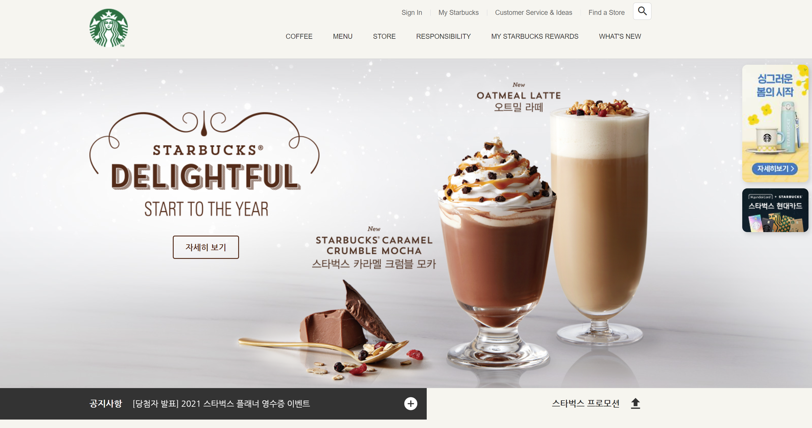

# 예제 2 - 스타벅스 랜딩 페이지

## 설명
- HTML/CSS/JS를 활용하여 애니메이션을 포함한 스타벅스 랜딩 페이지 구현
- 메인 페이지 + SIGNIN 예제
- <a href="https://scintillating-gnome-7293ce.netlify.app/" target="_blank">DEMO 페이지로 이동</a>


## 주요 파일/폴더
**index.html**  
**css**
- main.css
- signin.css
- common.css // 공통으로 사용되는 css  

**js**
- main.js
- youtube.js
- common.js // 공통으로 사용되는 js  

**images**
- 배경, 뱃지 등 이미지


## 사용 라이브러리

**[오픈 그래프 / 트위터 카드]**  
    - 웹페이지가 소셜 미디어(카카오톡, Slack 등)로 공유될 때 우선적으로 활용되는 정보 지정  
    - 페이지 title, 설명, image, url 등 

**[GSAP]**  
    - 자바스크립트로 웹 화면을 제어(세밀한 움직임, 동작의 연속성 등)하는 애니메이션 라이브러리
    - gsap cdn script 필수
    - gsap.to()
```
// VISUAL SECTION
// 각 이미지 fade-in 설정
const fadeEls = document.querySelectorAll('.visual .fade-in')

fadeEls.forEach(function (fadeEl, index){
    // gsap.to(요소, 지속시간, 옵션);
    // delay로 순서대로 보여지게 함
    gsap.to(fadeEl, 1, {
        delay: (index+1) * .5,
        opacity: 1
    });
});
```

**[ScrollToPlugin]**  
    - GSAP 추가기능으로 스크롤 애니메이션 라이브러리  
    - gsap, scrollToPlugin cdn 필수
    - scrollTo()
    ex) 버튼 클릭시, 최상단으로 화면 스크롤)
```
// TO-TOP ARROW(lodash, gsap, scrollToPlugin)
// _.throttle(함수, 시간), 스크롤이 지나치게 자주 발생하는 것 조절
const toTopEl = document.querySelector('#to-top');

window.addEventListener('scroll', _.throttle(function() {
    if(window.scrollY > 50){
        // arrow-upward 버튼 표시
        gsap.to('#to-top', .3, {
            x:0
        })
    } else {
        // arrow-upward 버튼 숨기기
        gsap.to('#to-top', .3, {
            x:900000
        })
    }
},300))

// arrow-upward 버튼 클릭 시, 최상단 0.7초 동안 이동
toTopEl.addEventListener('click', function(){
    gsap.to(window, .7, {
        scrollTo: 0
    })
})
```

**[Swiper]**  
    - 여러 기본 동작을 갖춘 현대적인 슬라이드 라이브러리
```
<!-- html -->
<div class="swiper-container">
  <div class="swiper-wrapper">
    <div class="swiper-slide">1</div>
    <div class="swiper-slide">2</div>
    <div class="swiper-slide">3</div>
  </div>
</div>
```

```
// 슬라이드 적용
// swiper - new Swiper(선택자, 옵션)
new Swiper('.notice-line .swiper-container', {
    direction: 'vertical', // 수직 슬라이드
    autoplay: true, // 자동 재생 여부
    loop: true // 반복 재생 여부
});
```

**[Youtube API]**  
    - Youtube 동영상 제어  
    - onYouTubePlayerAPIReady 함수명은 해당 IFrame Player API에서 사용하기 때문에 다르게 지정하면 정상 작동 불가능
```
<!-- in HEAD -->
<script defer src="./js/youtube.js"></script>

<!-- in BODY -->
<div id="player"></div>
```

```
// YOUTUBE IFrame API - 비동기로 로드
var tag = document.createElement('script');
tag.src = "https://www.youtube.com/iframe_api";

var firstScriptTag = document.getElementsByTagName('script')[0];
firstScriptTag.parentNode.insertBefore(tag, firstScriptTag);

// onYouTubeIframeAPIReady 함수명은 API에서 사용하기 때문에 변경 불가능
// <iframe> 생성
function onYouTubeIframeAPIReady() {
// <div id="player"></div>
new YT.Player('player', {
    videoId: 'An6LvWQuj_8', // 최초 재생할 유튜브 영상 ID
    playerVars: {
        autoplay: true, // 자동 재생 유무
        loop: true, // 반복 재생 유무
        playlist: 'An6LvWQuj_8', // 반복 재생할 유튜브 영상 ID
    },
    events: {
        // 영상이 준비되었을 때
        onReady: function(event){
            event.target.mute() // 음소거
        }
    }
});
}
```

**[ScrollMagic]**  
    - 스크롤과 요소의 상호작용을 위한 자바스크립트 라이브러리  
    - ScrollMagic cdn 필수
    - 주로 어떤 요소가 현재 화면에 보이는 상태인지 확인할 때 사용
    ex) 스크롤 위치에 따라 해당 이미지를 숨겼다가 나타나게 함
```
// scrollMagic
// 요소가 화면에 보여짐 여부에 따른 설정
const spyEls = document.querySelectorAll('section.scroll-spy');
spyEls.forEach(function(spyEl){
    // 특정한 요소를 감시하는 옵션을 지정하는 메소드 Scene()
    new ScrollMagic
        .Scene({ // 감시할 scene 추가
            triggerElement: spyEl, // 보여짐 여부를 감시할 요소를 지정
            triggerHook: .8 // 화면의 80% 지점에서 보여짐 여부 감시
        })
        .setClassToggle(spyEl, 'show') // 요소가 화면에 보이면 show 클래스 추가
        .addTo(new ScrollMagic.Controller()); // 컨트롤러에 장면을 할당(필수)
});
```

**[Lodash]**  
    - 배열이나 객체를 좀 더 간편하게 다루는 자바스크립트 라이브러리  
    - lodash cdn 필수
    - _.throttle() 사용 : 이벤트가 계속해서 함수를 호출하는 경우, 정해진 시간 동안 한 번만 호출하게 하는 기능
    ex) 스크롤)